## 开箱即用

### 标准模块划分（Layout）

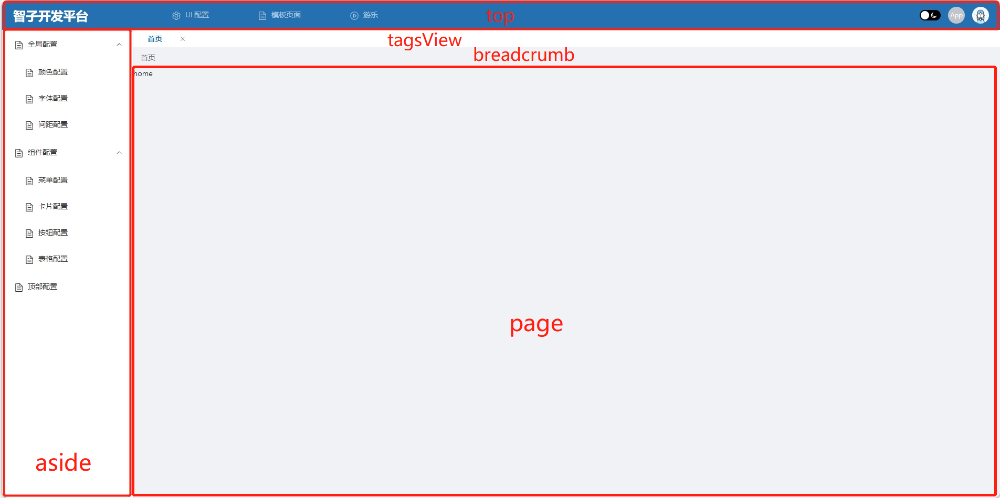

### 内置文档

```shell
npm run docs:dev
```

### 环境变量

```ts
// typings\app.d.ts 定义类型
interface ImportMetaEnv {
  /**
   * 资源公共路径
   */
  VITE_BASE_URL: string
  /**
   * 接口统一地址
   */
  VITE_BASE_API: string
}


```

+ 变量可补充，需要自行添加类型，并附上说明
+ 在 `app/.env.xxx` 中定义不同环境下变量

#### 预设变量

##### VITE_BASE_URL


+ 资源公共路径
+ 仅能在打包编译前修改
+ 开发中使用 `public` 下静态文件地址，需要加上 `VITE_BASE_URL`

##### VITE_BASE_API

默认接口统一地址

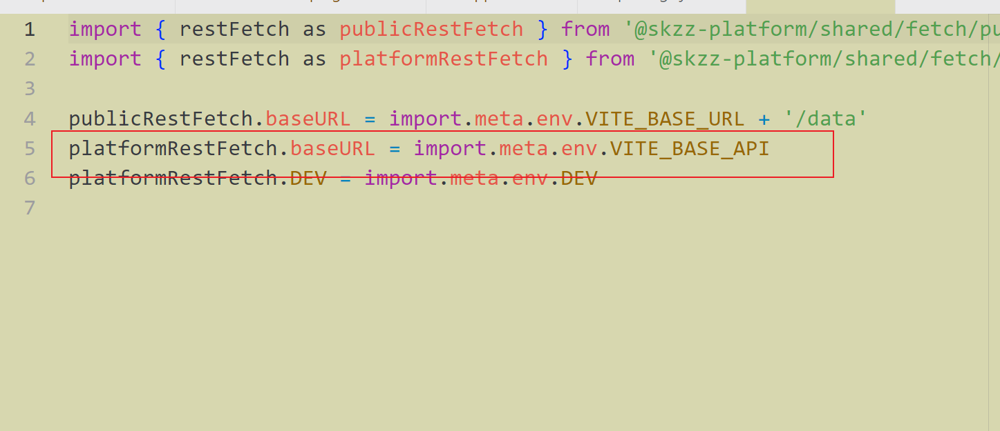

+ 在api初始化时赋值

#### 运行时修改

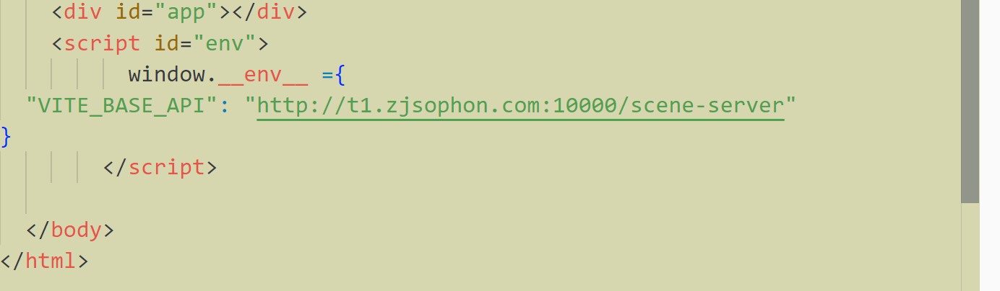

+ 打包后的 `index.html` ，将环境变量挂在了`window.__env__` 中
+ 可以避免一些可以应环境变量修改，而重新打包的问题

### 路由

+ `name: 'home'` 的路由，将作为登录页的默认跳转

#### 元信息

```ts
// app\typings\router.d.ts

/* 扩展 RouteMeta */
import *  as Icons from '@element-plus/icons-vue'
declare module 'vue-router' {

  interface RouteMeta {
    /**
     * 标题
     */
    title?: string
    
    /**
     * 图标
     */
    icon?: keyof typeof Icons
    /**
     * 是否一直显示，不会受到路由合并的影响
     */
    alwaysShow?: boolean

    /**
     * 是否隐藏
     */
    hidden?: boolean

    /**
     * 缓存
     */
    // noCache?: boolean
    
    /**
     * 控制当前路由是否出现在面包屑 
     * */
    breadcrumb?: boolean
    
    /**
     * 如果有路由被 header标记, 侧边菜单则仅展示该路由下的子路由
     * */ 
    header?: boolean 
      
    /**
     *  控制当前路由是否出现在标签页
     */
    tagsView?: boolean


  }
}

export {}

```


#### 远程路由

+ 远程请求的路由，需要在 `app\src\router\_remote\index.ts` 下配置

  

  + 在嵌套的路由结构中，会出现 `path: ''` 的路由，造成配置项键名冲突。在后面带上 `$` 作为区分。

+ `window.__VkSkzzFullpathSet__` 中，可以查看有哪些远程路由项

  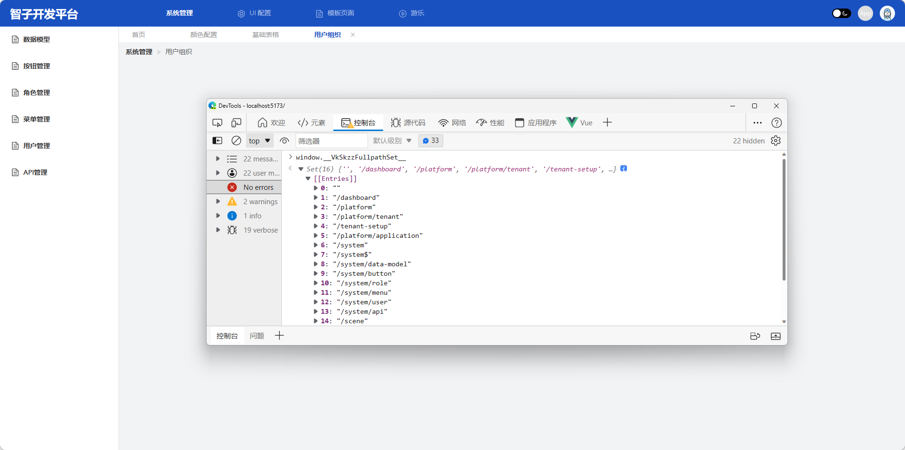

## 公用组件

### PageX

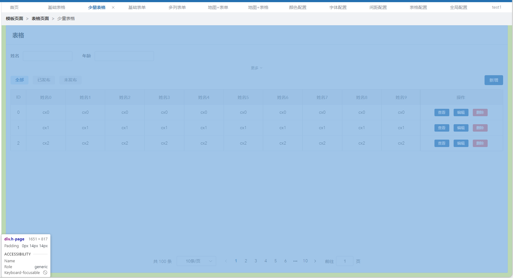

+ 通用 `page` 部分布局；
+  class `h-page`: 为 `page` 部分计算高度；
+ 若删除 `breadcrumb` ， `PageX`  组件内 添加  `pt-page` ；
+ `PageX` 挂载为全局组件；

### AppCard 

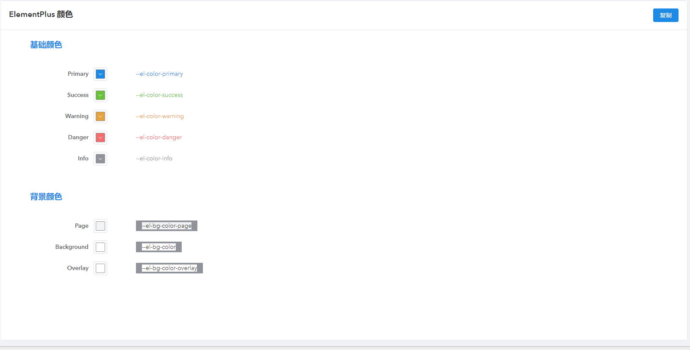

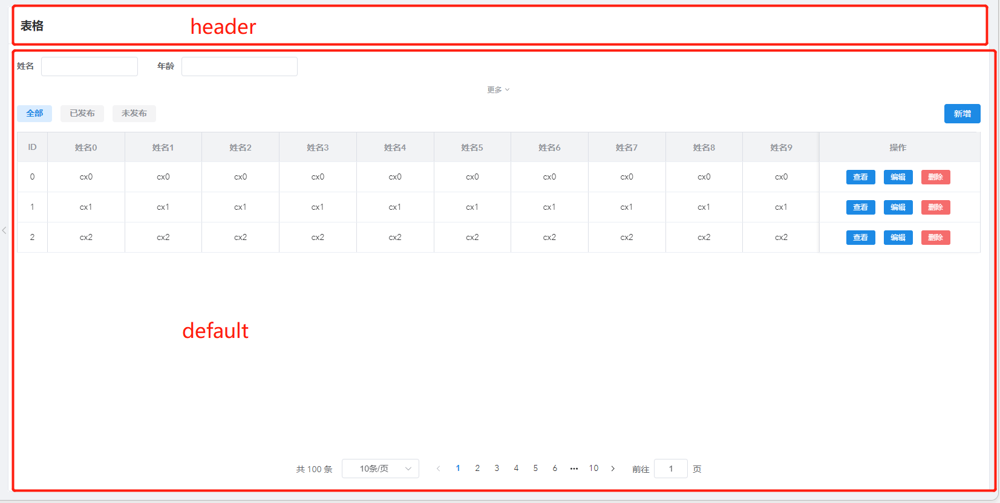

+ 基于 [ElCard]([Card 卡片 | Element Plus (element-plus.org)](https://element-plus.org/zh-CN/component/card.html)) 封装
+ `slots.header__options` ： 可定义右侧操作区按钮
+ `slots.header` : 可覆盖整个 `ElCard#header`
+ `slots.default`: 没有默认内边距，根据实际 **主体区** 内容设置

### AppModule

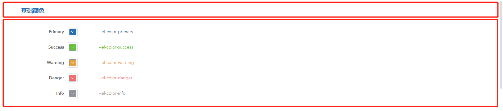

+ `props.title` : 标题文本
+ `props.type`:  预设的模块样式(`default` / `form`)

### MultipageRenderer

多页签渲染

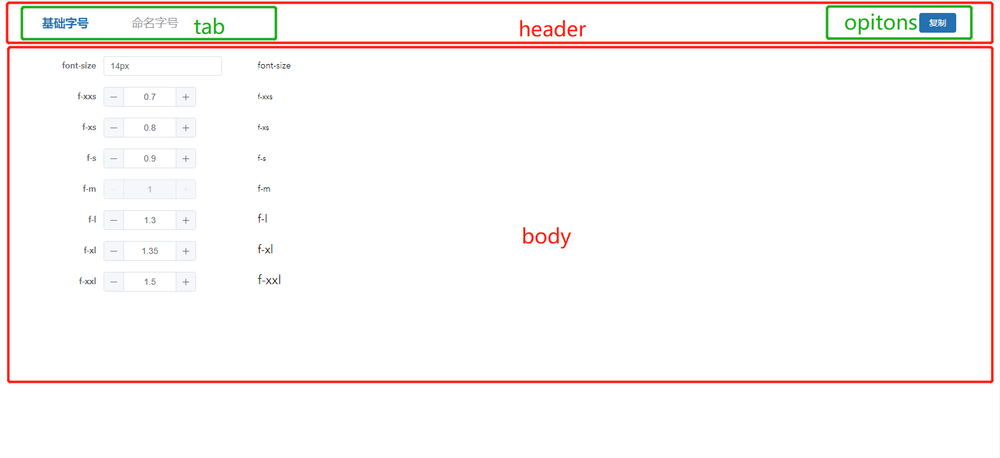

+ `tab` 区 默认没有 **左右内边距** 
+ 默认不包含高度信息
+ `props.tabXClass` : 为 `tab` 区 添加 `class`, 如 `plr-form-pl` 
+ `props.bodyClass`: 为`body`区 添加 `class` ，如 `h-100%`

+ 需要配合`MultipageTemplate` 使用：

  ```vue
    
    <SkMultipageRenderer
      v-model="currentPage"
      :tabXClass="'plr-form-pl'"
      :bodyClass="'h-100% '"
      :class="'h-100%'"
     >
      <SkMultipageTemplate :label="'选项1'" :value="'first'">
        <ElScrollbar >
          <FirstVue
            class="gap-form-x"
          ></FirstVue>
        </ElScrollbar>
      </SkMultipageTemplate>
  
      <SkMultipageTemplate :label="'选项2'" :value="'second'">
        <div>form</div>
      </SkMultipageTemplate>
    </SkMultipageRenderer>
  ```

  + `props.label`: 将展示在 `tab`上的文本
  + `props.value`: 作为 变量`currentPage` 的标识
  + `slots.options`: 每个页签 `options` 区，互相独立，通过该插槽写入

  

## 模板指导

### 表格

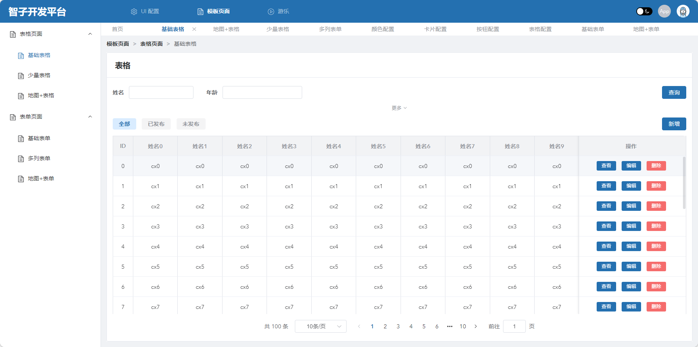

#### 标题区 （[AppCard](#AppCard)）


#### 主体区 （[AppCard](#AppCard)）

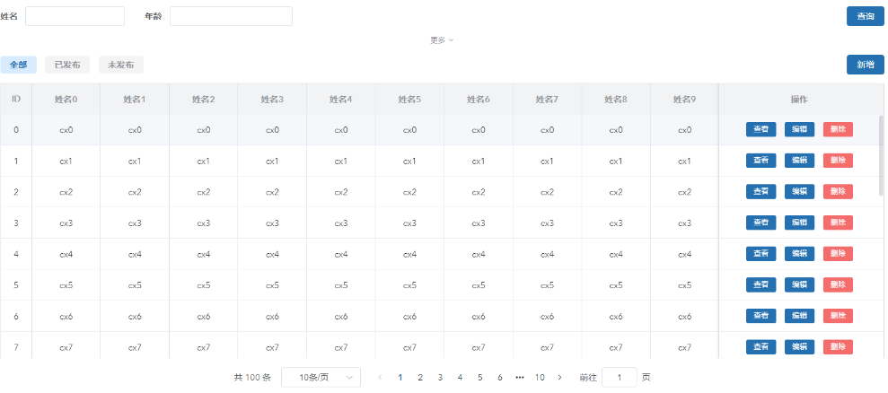

+ 内间距：(plr-page pt-main-pt pb-page) / (gap-main-x)

#### 查询区 （AppQueryForm）


+ `slots.options`  在操作区域自定义按钮
+ `props.fixes` 可以将相应数量的 表单项 固定展示，剩余会在更多显示。

#### 自定义功能区


+ 间距: ptb-page；
+ 布局: sk-flex="row-between-center"

#### 表格区 （AppTables）

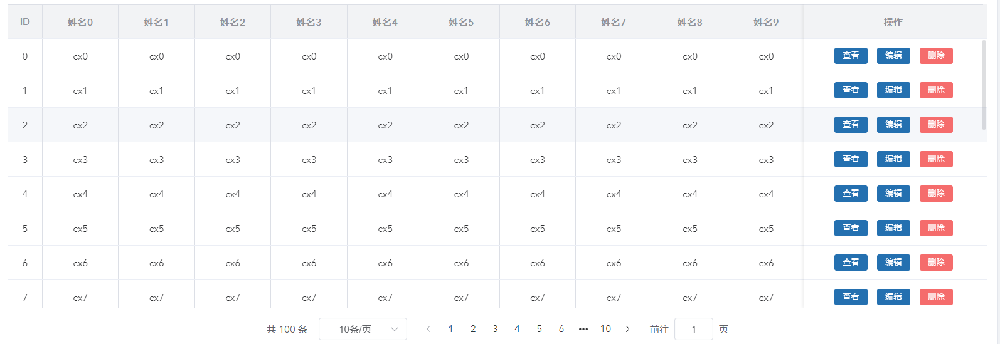

+ 基于  [ElTableV2](https://element-plus.org/zh-CN/component/table-v2.html#tablev2-属性) 封装
+ 横向滚动 需要添加 [ElTableV2](https://element-plus.org/zh-CN/component/table-v2.html#tablev2-属性).fixed 

### 表单

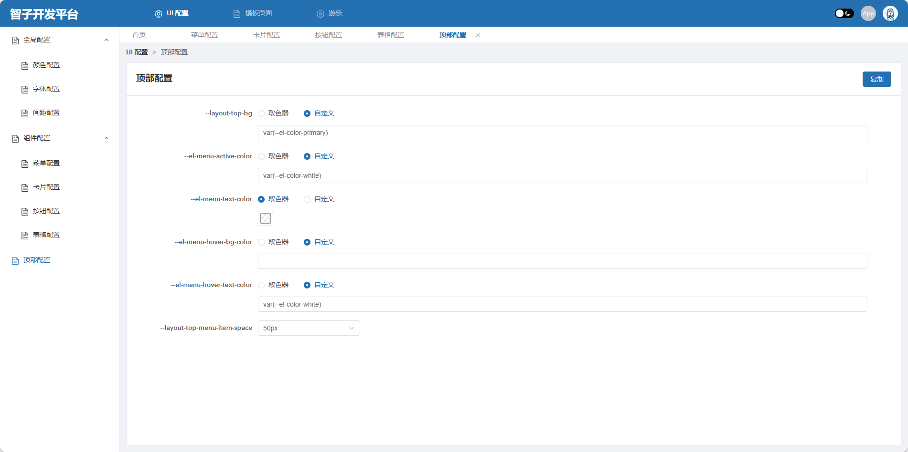

#### 标题区 （[AppCard](#AppCard)）

#### 主体区 （[AppCard](#AppCard)）

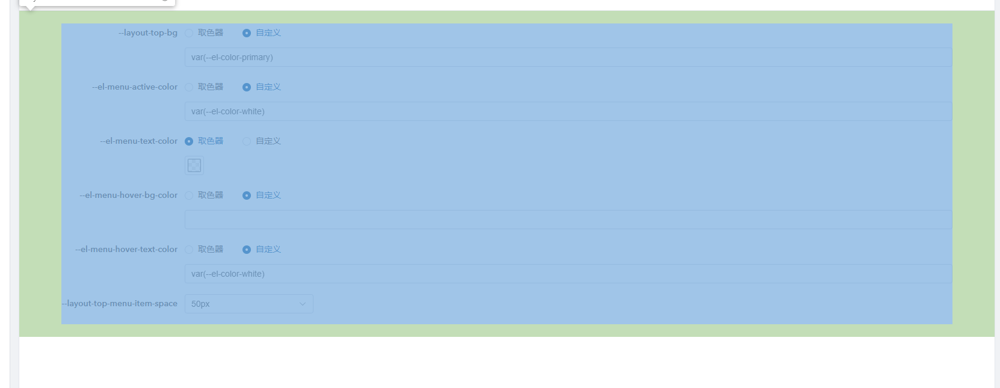

+ 根据内容 使用 [ElScrollbar](https://element-plus.org/zh-CN/component/scrollbar.html) 添加滚动条
+ 内间距：（ptb-form-pt plr-form-pl）/ （gap-form-x）
+ 根据 **表单区** **内间距** 可能交由内层决定

#### 表单区

##### 表单内容（AppForm）

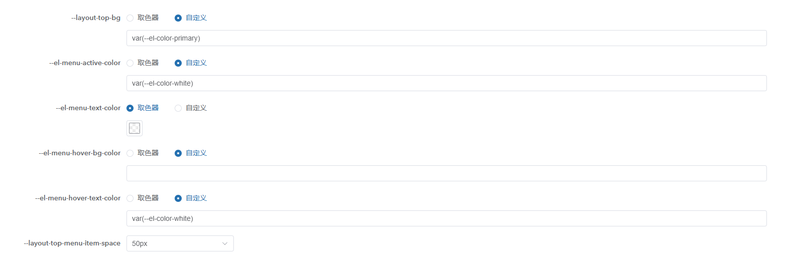

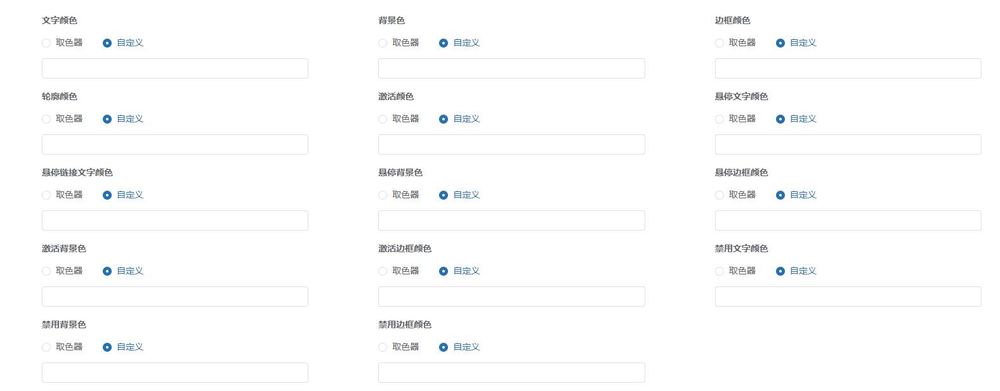

+ 基于 [VkfForm](http://192.168.110.130:4444/zh-CN/component/form.html) 封装
+ `props.layout` ： 若为`true`, 开启自动栅格排列（24span为一行）。`props.formItems` 中表单项中的 span 将生效，由此排列，默认为 `props.span`;
+ `props.span`: 每项排列默认值,  默认为 8；
+ 在表单内 可以使用，（pl-form-label）为自定义内容添加偏移

  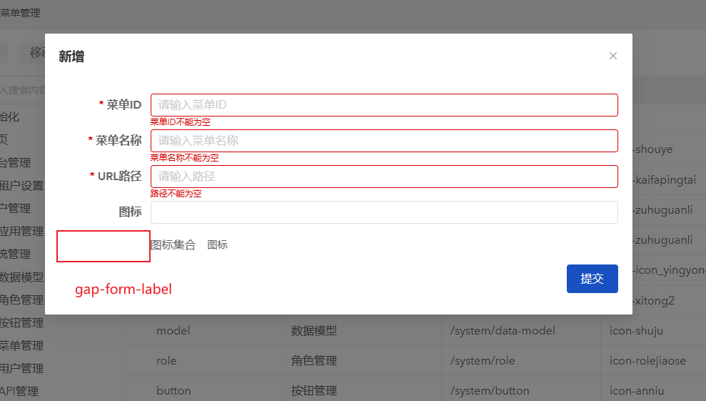

##### 多模块（[AppModule](#AppModule)）


+ 多表单可以使用 [AppModule](#AppModule) 划分
+ 多模块操作按钮，放置在 `AppCard slots.header__options`
+ 若外层间距未设，可使用 `AppModele props.type`: `form` ，来设置单独设置

##### 多页签([MultipageRenderer](#MultipageRenderer))


+ `:tabXClass="'plr-form-pl'"`

### 地图

#### 布局（GoldMapX）

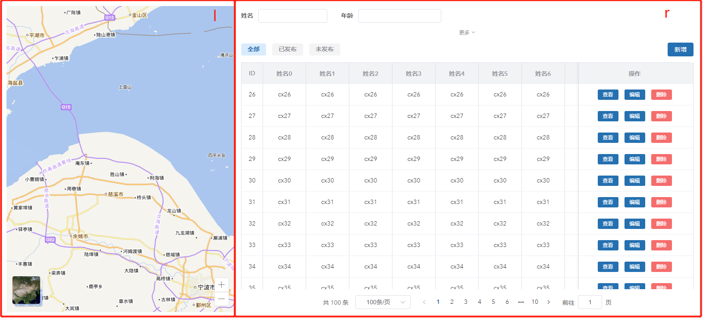

+ `primary` 为比例较大区域、`second`为比例较小区域
+ `props.type` : 从大到小排列模式 `'rtl'| 'ltr'`
+ `props.viewerIndex`: 地图放置位置  1 => l , 2 => r
+ `props.itemClass`: 为 子区域 设置 class， 默认：` 'overflow-hidden'`
+ `slots.map`： 地图内组件
+ `slots.default`: 另一个区域中的内容，
  + 里层可以使用 `useView`

#### 地图区

##### 地图内容（Viewer）

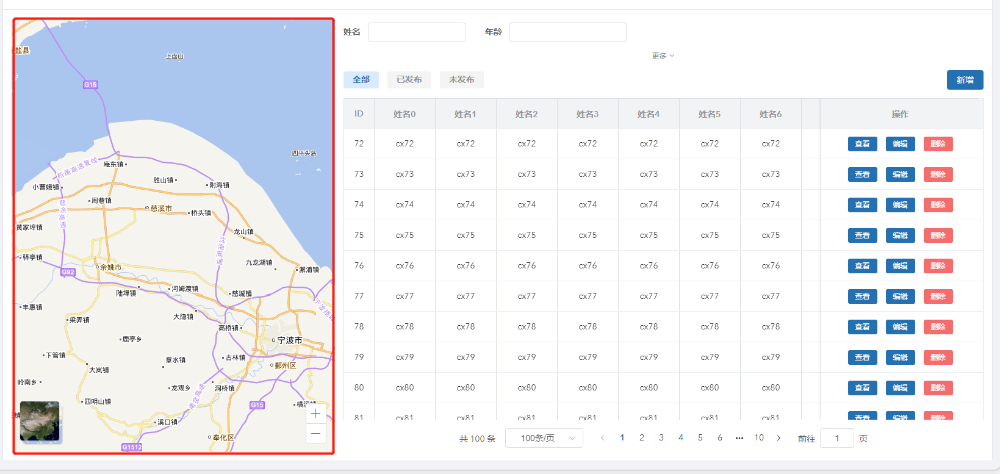

+ `GoldMapX` 默认引入组件`Viewer`
+ 地图内容预设，可根据业务修改

## 主题配置

### 全局配置

#### 颜色

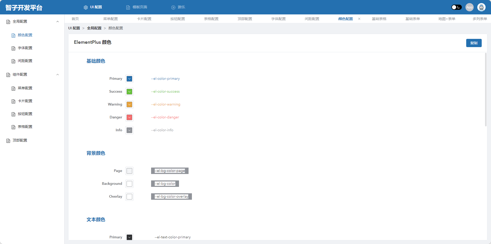

+ 以 `bg-` `text-` `border-` 使用颜色， 如 `bg-bg-page` `bg-primary`  
+ `bg-bg-base` 表示背景色使用 `--el-bg-color` , `text-text-primary` 表示文字色使用 `--el-text-color-primary` 

#### 字体

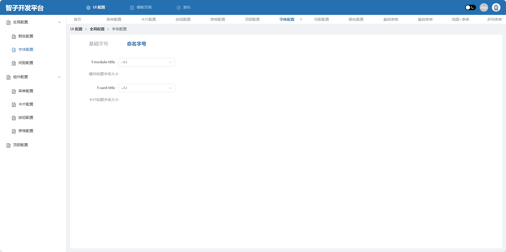

+ 使用  `f-`  前缀类名，可快速设置字体大小
+ `f-module-title`:  [AppModule ](#AppModule)模块标题字体大小
+ `f-card-title`: [AppCard](#AppCard) 卡片标题字体大小

#### 间距

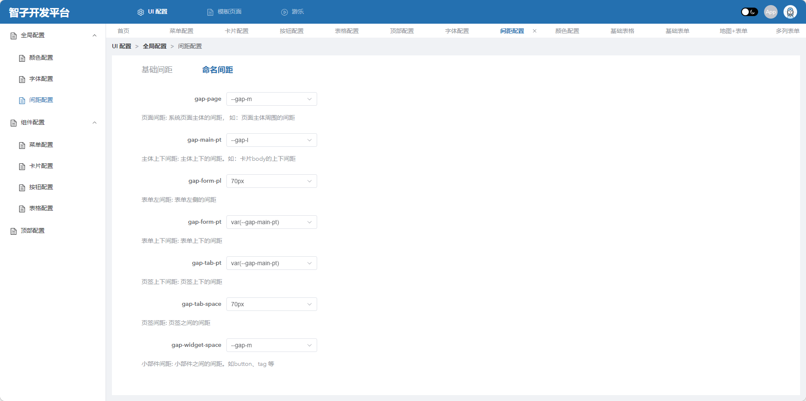

+ 使用 `pl pr plr pt pb ptb pa` `ml mr mlr mt mb mtb ma ` 可以快速使用 间距 设置`padding` `margin`

##### --gap-page

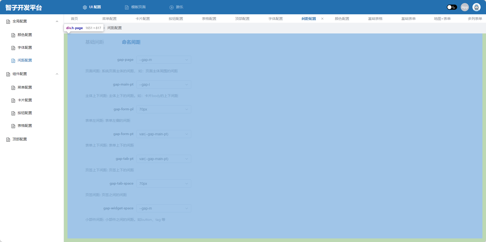

##### --gap-main-pt

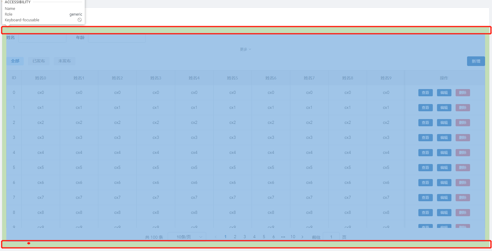

##### --gap-form-pl

##### 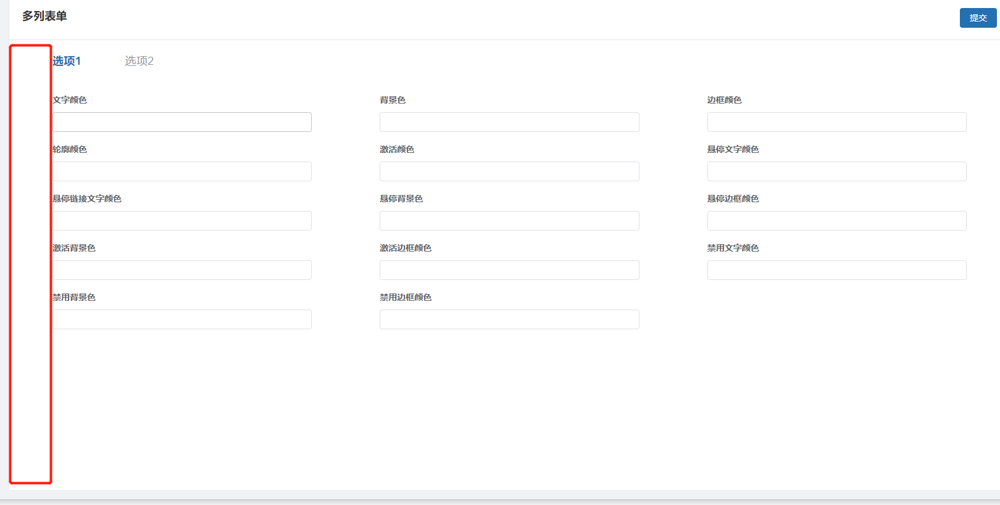--gap-form-pt

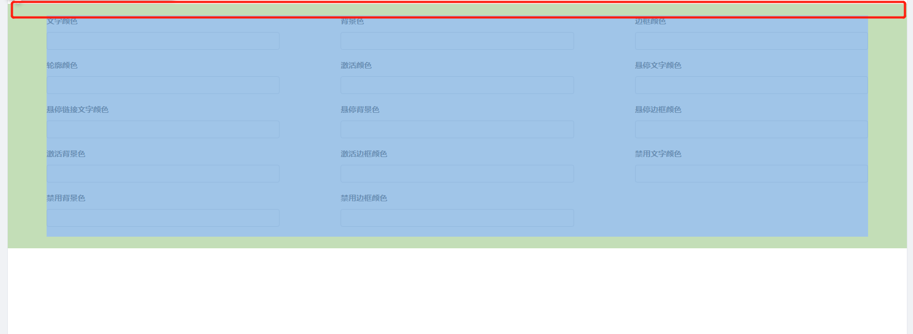

##### --gap-tab-pt / --gap-tab-space


##### --gap-widget-space


### 模块主题

#### 自定义

1. 在 `packages/theme` 中，暴露模块主题涉及的变量字段, 如

   ```ts
   export const elTableV2Theme = {
     '--el-table-border-color': 'var(--el-border-color-lighter)',
     '--el-table-border': '1px solid var(--el-table-border-color)',
     '--el-table-text-color': 'var(--el-text-color-regular)',
     '--el-table-header-text-color': 'var(--el-text-color-secondary)',
     '--el-table-row-hover-bg-color': 'var(--el-fill-color-light)',
     '--el-table-current-row-bg-color': 'var(--el-color-primary-light-9)',
     '--el-table-header-bg-color': 'var(--el-bg-color-page)',
     '--el-table-fixed-box-shadow': 'var(--el-box-shadow-light)',
     '--el-table-bg-color': 'var(--el-fill-color-blank)',
     '--el-table-tr-bg-color': 'var(--el-fill-color-blank)',
     '--el-table-expanded-cell-bg-color': 'var(--el-fill-color-blank)',
   }
   ```

2. 在 `packages/composables/theme` 中，定义 **运行时** 全局变量，如：

   ```ts
   const tableV2Styles = useRootStyles(key, '.el-table-v2')
   ```

   + 第一个参数： style 信息将持久化储存在 `[key]` 中 
   + 第二个参数： 运行时， css规则将被设置在 `.el-table-v2` 选择器下

3. 在 `app/composables/use-init-theme` 中，添加初始化 函数， 如：

   ```ts
   const useTableV2Theme = () => {
     const themeStore = useThemeStore()
     const setTableV2 = () => {
       Object.keys(elTableV2Theme).forEach((_key) => {
         const key = _key as keyof typeof elTableV2Theme
         if (themeStore.tableV2Styles[key]) {
           return
         }
         themeStore.tableV2Styles[key] = elTableV2Theme[key]
       })
     }
     setTableV2()
   }
   export const useInitTheme = () => {   // 初始化theme，用来首次设置theme变量
     // ...
     useTableV2Theme()
   }
   ```

4. 在 `app/router/_ui-config` 中，添加配置页面路由。

5. 在 `app/views/_ui-config` 中，添加配置页面。如：

   ```vue
   <script lang="ts" setup>
   import { SkAppCard, SkAppModule } from '@skzz/platform'
   import ConfigVue from './config.vue'
   import BasicVue from './basic.vue'
   
   import { useThemeStore } from '@/stores/theme'
   import { setData } from '@vunk/core'
   const themeStore = useThemeStore()
   
   </script>
   <template>
     <page-x>
       <SkAppCard class="h-100%" :header="'表格配置'">
         <ElScrollbar>
           <SkAppModule :title="'配置表单'">
             <ConfigVue
               :data="themeStore.tableV2Styles"
               @setData="setData(themeStore.tableV2Styles, $event)"
             ></ConfigVue>
           </SkAppModule>
           <SkAppModule :title="'配置用例'">
             <BasicVue></BasicVue>
           </SkAppModule>
         </ElScrollbar>
      
       </SkAppCard>
     </page-x>
   </template>
   ```

   + 通过修改 `themeStore.tableV2Styles` 中的字段，实现动态切换样式。

### 简写class

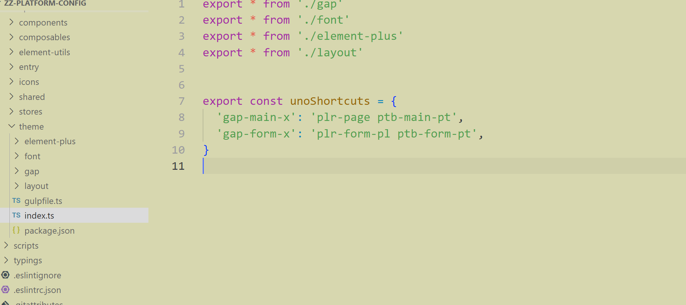

+ `unoShortcuts` 变量中可以配置 class 简写

#### gap-main-x

+ 主体（`table`）区域 边距

#### gap-form-x

+ `form` 区域边距

## 破坏更新

### v1.0

+ 全局命名类更新

  全局文文本替换：main-ptb => main-pt； form-ptb => form-pt；tab-ptb => tab-pt

+ 


